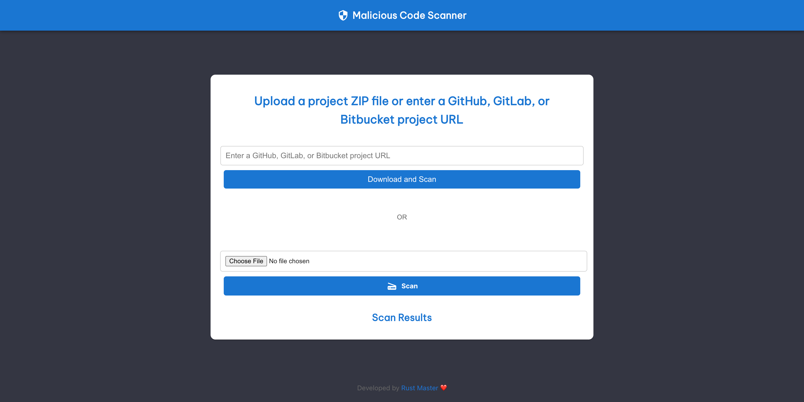

# Malicious Code Scanner
This project aims to detect and scan the malicious code in the project. Mostly these types of scam projects are on freelancing marketplaces

### Live Demo https://malicious-code-scanner.vercel.app
 

## New Features
- GitHub Repo URL

## Available Scripts

In the project directory, you can run:

### `npm start`

Runs the app in the development mode.\
Open [http://localhost:3000](http://localhost:3000) to view it in your browser.
